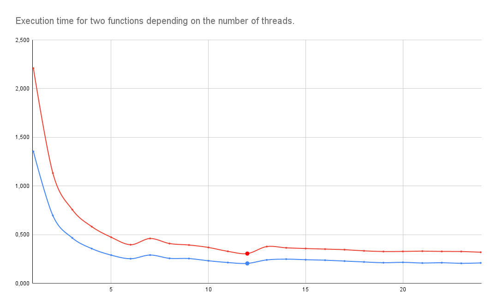

#  Monte Carlo method for calculating integral
## Description
Splitting a program into threads often speeds up program execution. As a homework assignment, we measured the performance of the [Monte Carlo method](https://en.wikipedia.org/wiki/Monte_Carlo_method/ "Link to wikipedia"). 

We have used the Monte Carlo method to find a certain integral of non-negative monotonically increasing functions.

## Approach to measure
Util **time** can measure real execution time. We wrote **run.sh** script to run this utility 5 times for each number of threads (1 - 24).

## Results 

As we can see, the minimum execution time in both cases is achieved with 12 threads, which corresponds to the number of threads of our cpu (AMD Ryzen 5 4600H).
